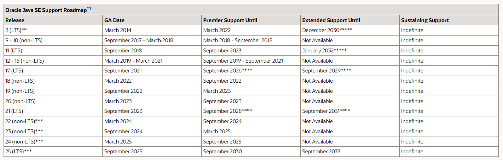
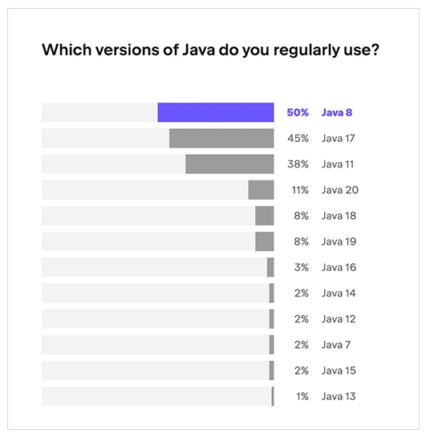

# JAVA (Study)

##  JAVA LTS version with Date

#### - 2023년 8월 까지 Update 되어진 java version 들의 LTS 기간이다
#### 출처 : [ORACLE](https://www.oracle.com/java/technologies/java-se-support-roadmap.html)

## JAVA USAGE version with Percent

#### - 2023년 기준으로 JetBrains에서 나온 JAVA 버전 사용 퍼센트이다.
#### 출처 : [CODEGYM](https://codegym.cc/groups/posts/18463-java-in-2023-version-releases-popularity-and-future-trends)

## JAVA란
    JAVA는 객체지향적 프로그래밍 언어이다.
    
    장점
    
    1. 객체지향 언어
        - 유지 보수 및 확장성이 좋다.
    2. 이식서이 높다.
        - JVM 위에서 동작하기에 운영체제에 의존적이지 않다.
    3. 메모리를 자동으로 관리한다.
        - GC(가비지 컬렉터) 등이 메모리를 자동으로 관리 함으로써 안정적인 프로그래밍이 가능하다.
        - C/C++ 과 같은 언어는 malloc을 사용하여 메모리를 release 해주는 방식을 사용함.
    4. 멀티 스레드 구현에 용이하다.
        - 스레드 생성 및 제어를 해주는 라이브러리를 제공한다.
    5. 오픈 소스 라이브러리가 풍부하다.

    단점
    
    1. JVM에 의해 기계어로 번역되어 실행되어지므로 다른 언어들(컴파일 후 바로 실행 되어지는 언어)과 비교하여 속도가 떨어진다.
    2. 코드를 작성해야하는 길이가 긴편이다.
    3. 장점일 수도 있는 단점으로는 예외를 개발자가 직접 관리해야한다.

## JAVA를 사용하는 이유 
    
    1. JAVA는 객체지향 프로그래밍 언어중 가장 대중적이며 많은 회사들에서 채택되어져 사용 되어지고 있다. (안전성 보장) 
    2. JAVA의 경우 버전이 업그레이드 되어져도 하위 버전과의 호환성을 중요하게 여기고 있다.  (버전 업으로 인한 side effect 감소)
    3. 장점 5번의 경우처럼 JAVA는 많은 커뮤니티와 레퍼런스가 많다. (접근성 탁월)
    
    대표적으로 위 3가지 이유로 인해 많이 사용하지 않을까 싶다.

## JAVA8
    변경사항 정리
    1. Lambda expression
    2. Functional interface
    3. Default method
    4. stream
    5. Optional
    6. Date Time Package
    7. JVM 변화

## JAVA11
    변경사항 정리
    1. 컬렉션을 쉽게 구성 
    2. Stream 추가 메서드 
    3. interface private method 사용 가능 
    4. 변수 유형 추론 var 키워드 도입 
    5. 병렬처리 가비지 컬렉션 도입 
    6. Oracle Jdk 와 OpenJdk 통합 -> Oracle JDK는 유료화 되어진다.
    7. 기타 추가 

## Spring initializr
    spring boot 3.2.3 & java 21, 17